Today credit cards are one of the most useful financial tools. Traditionally, having a credit card was a sign of having high economic power, but this has now changed. Now we have at our disposal a wide variety of types of credit cards. This is because not only banks can offer them, but some businesses have also started offering credit cards to adapt to the needs of consumers.


Credit cards have multiple functions and not everyone who has one implements it for the same purpose, so we want to know the behavior of use of approximately 9,000 active credit card holders, which have 17 variables of behavior, we carry out a segmentation of groups among the individuals to be studied, in relation to their behaviors; thus allowing us to simplify the complexity of the sample space with many dimensions while preserving its information.


In our database we take into account the following data...

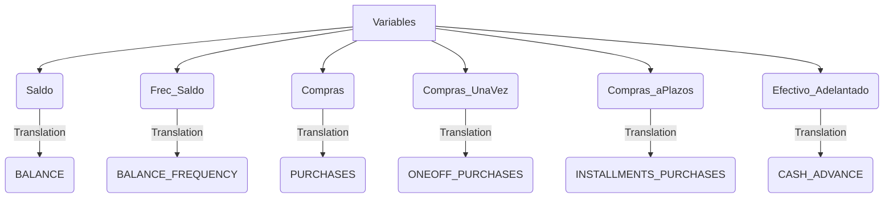


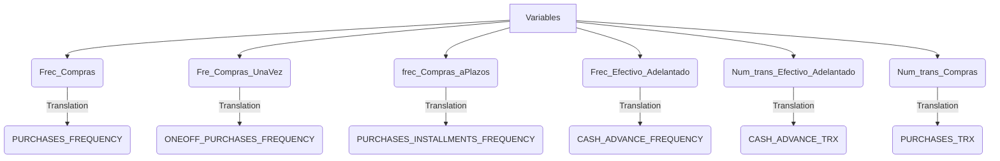


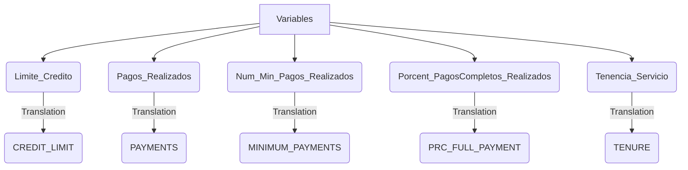


**Unsupervised analysis bases its training process on a data set that does not have a previously established label. Multivariate methodologies are relevant to finding answers about data.**


The Principal Component Analysis (PCA) technique, applied by Karl Pearson, who was responsible for the application of statistics, as the PCA method in 1901; is used for quantitative variables, allowing to simplify the dimension of the data creating new variables to characterize each individual, these variables are called main components, which are given by the following linear combination


$$Z = \lambda_1 X_1 + \lambda_2 X_2 + . . . +  \lambda_p X_p$$


To see the classification of the model data set, Ward's method is used, presented by Joe H. Ward, which considers all the clusters and the algorithm calculates the sum of the squared distances within each one, to later merge them and manage to minimize them.


## Let's go to R

We point out that the code and results is in spanish. This was made by [Kleiner J. Balanta](https://www.linkedin.com/in/kleiner-johan-balanta-amu-aa2611214/)

### Code


 

```r
library(tidyverse)
library(dendextend)
library(factoextra)
library(FactoClass)
library(corrplot)
library(caret)
library(stats)
library(dplyr)
```




 


```r

Datos_Base<-read.csv("https://github.com/juniorjb5/Data/blob/main/TarjetasCredito.csv"
                      ,header = TRUE, sep = "," ,dec = ".", row.names = 1)  #En ese link consigues los datos

is.na(Datos_Base) # True: Nas y False: Datos

sum(is.na(Datos_Base)) #314 Na's

sum(complete.cases(is.na(Datos_Base))) #8950 Datos
# De 9264 observaciones, solo 8950 tienen observaciones sin Na's. Es decir, trabajamos
#con el 96,51% de las observaciones de la base de datos original. Aun es una buena base de datos.

Datos<-na.omit(Datos_Base)
View(Datos)

#Cambio de nombre de las columnas de la base de datos
Datos <- Datos %>% 
  rename(Saldo=BALANCE,Frec_Saldo=BALANCE_FREQUENCY,
          Compras=PURCHASES,Compras_UnaVez=ONEOFF_PURCHASES, 
         Compras_aPlazos=INSTALLMENTS_PURCHASES,Efectivo_Adelantado=CASH_ADVANCE, 
         Frec_Compras=PURCHASES_FREQUENCY,Fre_Compras_UnaVez=ONEOFF_PURCHASES_FREQUENCY,
         frec_Compras_aPlazos=PURCHASES_INSTALLMENTS_FREQUENCY,Frec_Efectivo_Adelantado=CASH_ADVANCE_FREQUENCY,
         Num_trans_Efectivo_Adelantado=CASH_ADVANCE_TRX ,Num_trans_Compras=PURCHASES_TRX,
         Limite_Credito=CREDIT_LIMIT ,Pagos_Realizados=PAYMENTS,Num_Min_Pagos_Realizados=MINIMUM_PAYMENTS
         ,Porcent_PagosCompletos_Realizados=PRC_FULL_PAYMENT
         ,Tenencia_Servicio=TENURE) 
```




 


```r
matriz_correlacion<- cor(Datos)
print(matriz_correlacion)
Alta_Correlacion <- findCorrelation(matriz_correlacion,cutoff = 0,1)

print(names(Datos[,Alta_Correlacion]))

x11()
corrplot(cor(Datos), type="upper", method="ellipse", tl.cex=0.9)
```



The figure shows the correlation among all variables in the database

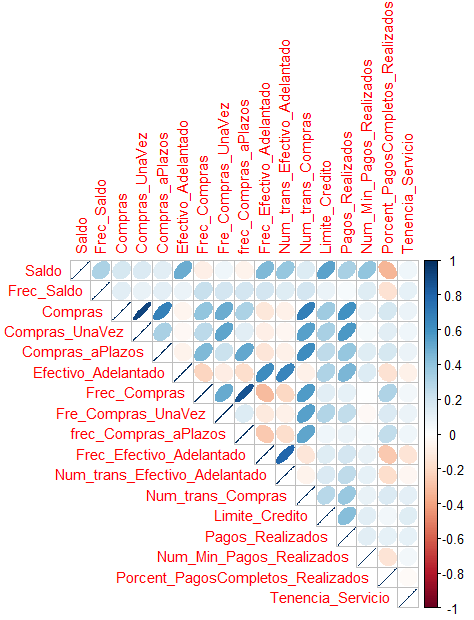


 


```r
# Componentes: Varianza explicada

res.pca <- prcomp(Datos, scale = TRUE)

res.pca[[1]]

fviz_eig(res.pca,ylab = "porcentaje de varianza explicada",
         xlab= "numero de componentes", main = "." ,barfill = "#0B7D75",addlabels = TRUE) + theme_classic() 

```



There are different varieties of criteria that help to select the number of components, in this case it was decided to use one of the most famous called the Kaiser criterion. For this reason, the eigen values of the first 5 components were found, which are reflected in the following table


| PC 1  | PC 2 | PC 3  | PC 4 | PC 5  |
| ------------- | ------------- | ------------- | ------------- | ------------- |
| 2.151580834 | 1.861083634 | 1.231306920 | 1.134686503 | 1.032969064 | 


The Kaiser criterion recommends that 5 components should be selected. However, the value of the eigenvalues between components 3, 4 and 5 do not vary much compared to the first 2 components. Given this observation, it was decided to plot a bar chart with the percentage of variance or explanation provided by each component, in order to have a broader and more detailed view of the choice of components


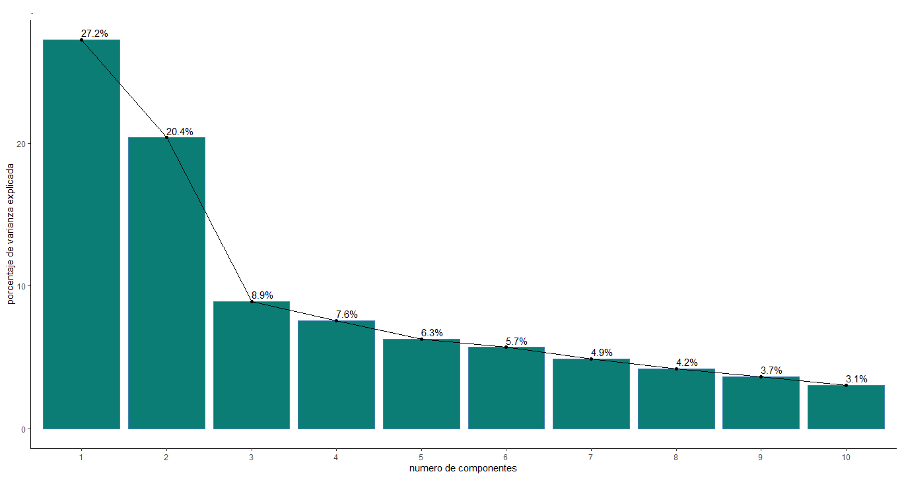


The graph shows an interesting behavior, components 3, 4 and 5 do meet the Kaiser criterion as mentioned above, but between these the percentage of explained information does not have much difference, so it can be said that there is noise between them. . For this reason, it was decided to use 3 components, that is, we have a variance percentage of approximately 56.5% for our analysis.


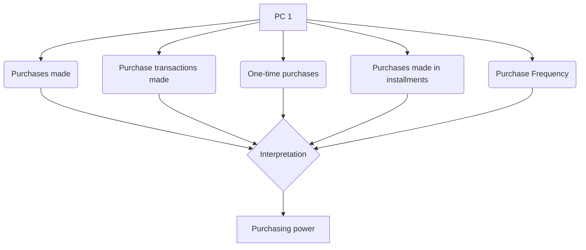

> Based on the variables that most influence the explanation of the first component, this factor was named purchasing power; since its definition that groups and relates the variables. "Purchasing power, purchasing power or purchasing power is the amount of goods or services that can be obtained with a fixed amount of money depending on the price level"


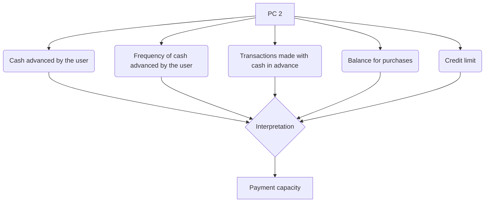


> Regarding the second component, it was called payment capacity, since in agreement with the Bank of Mexico (Banxico), there are users who have fixed monthly income and when making purchases they make their payments in cash or at the end of the month to avoid interest and build a good credit history, plus maintain access to the rewards and benefits on offer.


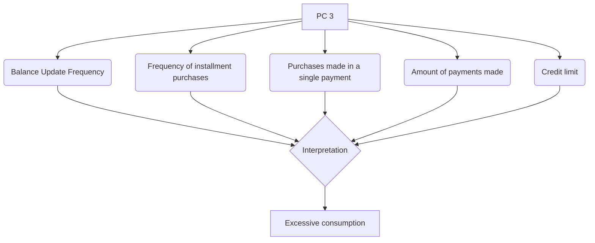


> Finally, the third component was called excessive consumption, according to Marco Carrera, director of Market Studies of the National Commission for the Defense of Users of Financial Services (Condusef) in 2009, people who frequently buy from purchases that satisfy their basic needs are considered people who fall into the trend of consumerism, for which they see the need to pay the minimum cost of credit cards and thus maintain their credit limit and all the benefits that this entails.


 


```r
fviz_pca_ind(res.pca,
             col.ind = "cos2", # Color by the quality of representation
             gradient.cols = c("#00AFBB", "#E7B800", "#FC4E07"),
             repel = FALSE     # Avoid text overlapping
)

fviz_pca_var(res.pca,
             col.var = "contrib", # Color by contributions to the PC
             gradient.cols = c("#00AFBB", "#E7B800", "#FC4E07"),
             repel = FALSE    # Avoid text overlapping
)


fviz_pca_biplot(res.pca, repel = FALSE,
                col.var = "#2E9FDF", # Variables color
                col.ind = "#696969"  # Individuals color
)


eig.val <- get_eigenvalue(res.pca)
eig.val #Valores propios de los componentes compuestos

res.var <- get_pca_var(res.pca)
res.var$coord          # Coordinates
res.var$contrib        # Contribuccion de las variables  a los ejes
res.var$cos2           # Quality of representation

View(res.var$contrib[,1:3]) # Miro los 3 primeros factores
 

# Resultados por individuos
res.ind <- get_pca_ind(res.pca)
res.ind$coord          # Coordinates
res.ind$contrib        # Contribuccion a los componentes
res.ind$cos2           # Quality of representation 


View(res.ind$contrib[,1:3]) # Miro los tres primeros factores


```




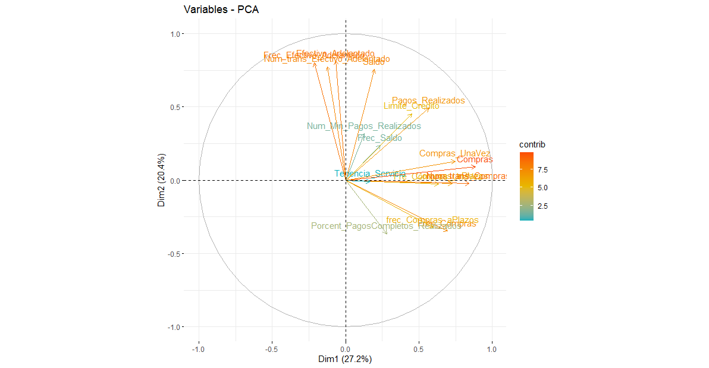

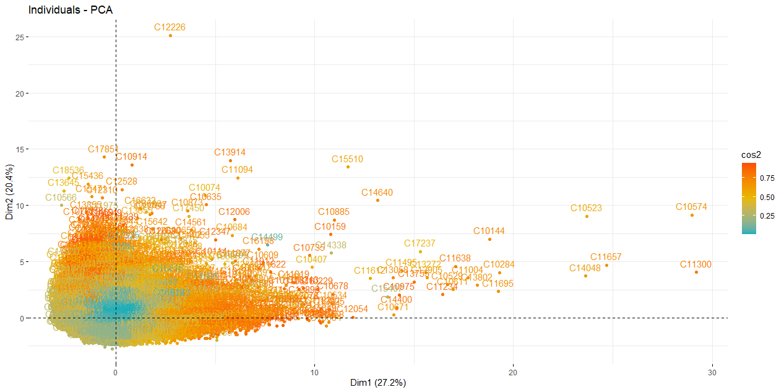


 


```r
resultado_ACP<-FactoClass(Datos,dudi.pca)

3 
3 
4 

resultado_ACP$cluster 

NuevaBase<-data.frame(Cluster=resultado_ACP$cluster,Datos)  # unir la nueva base de datos con la nueva variable cluster
View(NuevaBase)

plot(resultado_ACP$dudi) # Grafico del an?lisis

s.corcircle((resultado_ACP$dudi)$co)

s.label((resultado_ACP$dudi)$li,label=row.names(Datos)) #Graf. Individuos

s.label((resultado_ACP$dudi)$co,xax=1,yax=2,sub="Componente 1 y 2",possub="bottomright",) #Graf. Variables

s.label((resultado_ACP$dudi)$co,xax=1,yax=3,sub="Componente 1 y 3",possub="bottomright",) #Graf. Variables

s.label((resultado_ACP$dudi)$co,xax=2,yax=1,sub="Componente 2 y 1",possub="bottomright",) #Graf. Variables

s.label((resultado_ACP$dudi)$co,xax=2,yax=3,sub="Componente 2 y 3",possub="bottomright",) #Graf. Variables

s.label((resultado_ACP$dudi)$co,xax=3,yax=1,sub="Componente 3 y 1",possub="bottomright",) #Graf. Variables

s.label((resultado_ACP$dudi)$co,xax=3,yax=2,sub="Componente 3 y 2",possub="bottomright",) #Graf. Variables


x11()

scatter(resultado_ACP$dudi,xax=1,yax=2,sub="Componente 1 y 2",possub="bottomright") # Graf. Conjuntos

X11()
scatter(resultado_ACP$dudi,xax=1,yax=3,sub="Componente 1 y 3",possub="bottomright")

X11()
scatter(resultado_ACP$dudi,xax=2,yax=1,sub="Componente 2 y 1",possub="bottomright")

X11()
scatter(resultado_ACP$dudi,xax=2,yax=3,sub="Componente 2 y 3",possub="bottomright")

X11()
scatter(resultado_ACP$dudi,xax=3,yax=1,sub="Componente 3 y 1",possub="bottomright")

X11()
scatter(resultado_ACP$dudi,xax=3,yax=2,sub="Componente 3 y 2",possub="bottomright")


Grupo<-NuevaBase$Cluster


X11()
s.class((resultado_ACP$dudi)$li,Grupo,sub="Componentes 1 y 2",possub="bottomright",xax=1,yax=2,col=c(1,2,3,4))

X11()
s.class((resultado_ACP$dudi)$li,Grupo,sub="Componentes 1 y 3",possub="bottomright",xax=1,yax=3,col=c(1,2,3,4))

X11()
s.class((resultado_ACP$dudi)$li,Grupo,sub="Componentes 2 y 1",possub="bottomright",xax=2,yax=1,col=c(1,2,3,4))

X11()
s.class((resultado_ACP$dudi)$li,Grupo,sub="Componentes 2 y 3",possub="bottomright",xax=2,yax=3,col=c(1,2,3,4))

X11()
s.class((resultado_ACP$dudi)$li,Grupo,sub="Componentes 3 y 1",possub="bottomright",xax=3,yax=1,col=c(1,2,3,4))


X11()

s.class((resultado_ACP$dudi)$li,Grupo,sub="Componentes 3 y 2",possub="bottomright",xax=1,yax=2,col=c(1,2,3,4))
#importante


#DescripciÓn de los grupos (Análisis de medias)
resultado_ACP$carac.cont 


```



**Dendogram**

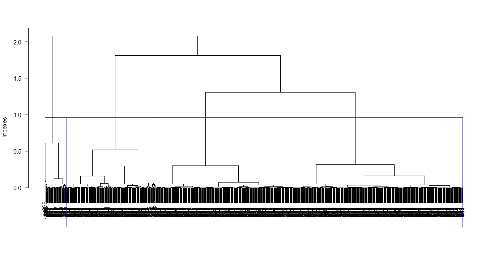

**PC1 vs PC2**

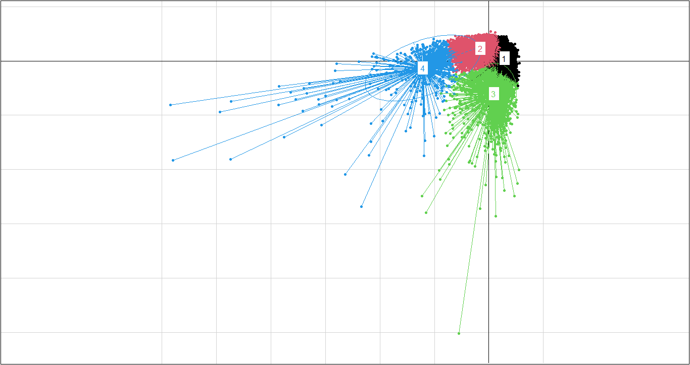

**PC1 vs PC3**

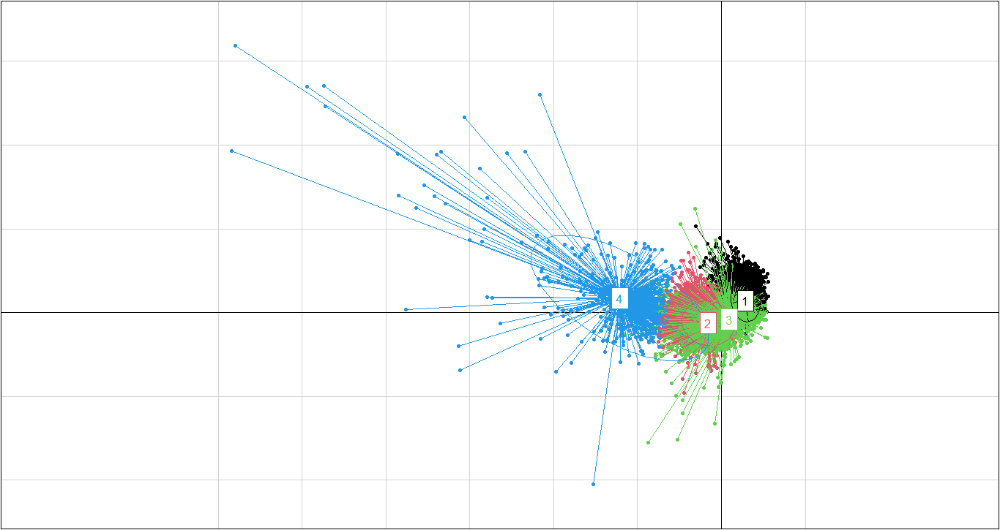

**Class characterization**

```r
class: 1
                                  Test.Value Class.Mean Frequency Global.Mean
Frec_Compras                          68.218      0.938      2657       0.496
frec_Compras_aPlazos                  61.895      0.767      2657       0.369
Fre_Compras_UnaVez                    40.837      0.404      2657       0.206
Compras_aPlazos                       34.321    929.010      2657     420.844
Compras                               28.956   2038.379      2657    1025.434
Porcent_PagosCompletos_Realizados     25.250      0.280      2657       0.159
Frec_Saldo                            24.426      0.977      2657       0.895
Compras_UnaVez                        18.570   1109.784      2657     604.901
Limite_Credito                        13.143   5298.450      2657    4522.091
Pagos_Realizados                       5.278   2032.412      2657    1784.478
Saldo                                 -7.423   1350.131      2657    1601.225
Efectivo_Adelantado                  -21.528    256.949      2657     994.176
Frec_Efectivo_Adelantado             -28.902      0.043      2657       0.138
------------------------------------------------------------ 
class: 2
                                  Test.Value Class.Mean Frequency Global.Mean
Frec_Efectivo_Adelantado             -10.482      0.118      4960       0.138
Num_Min_Pagos_Realizados             -14.953    535.657      4960     864.305
Porcent_PagosCompletos_Realizados    -16.299      0.115      4960       0.159
Efectivo_Adelantado                  -18.377    633.015      4960     994.176
Compras_UnaVez                       -25.412    208.401      4960     604.901
Pagos_Realizados                     -28.894   1005.618      4960    1784.478
Saldo                                -29.143   1035.473      4960    1601.225
Frec_Saldo                           -31.424      0.835      4960       0.895
Compras                              -35.002    322.735      4960    1025.434
Compras_aPlazos                      -36.037    114.633      4960     420.844
Limite_Credito                       -36.397   3288.275      4960    4522.091
Fre_Compras_UnaVez                   -37.545      0.102      4960       0.206
frec_Compras_aPlazos                 -50.555      0.182      4960       0.369
Frec_Compras                         -55.501      0.290      4960       0.496
------------------------------------------------------------ 
class: 3
                                  Test.Value Class.Mean Frequency Global.Mean
Efectivo_Adelantado                   60.918   4968.608       942     994.176
Frec_Efectivo_Adelantado              60.158      0.511       942       0.138
Saldo                                 53.513   5049.907       942    1601.225
Limite_Credito                        32.142   8139.124       942    4522.091
Pagos_Realizados                      24.556   3981.927       942    1784.478
Num_Min_Pagos_Realizados              22.039   2472.399       942     864.305
Frec_Saldo                            12.669      0.976       942       0.895
Compras_UnaVez                        -4.497    371.965       942     604.901
Fre_Compras_UnaVez                    -6.205      0.149       942       0.206
Compras                               -6.405    598.583       942    1025.434
Compras_aPlazos                       -6.882    226.726       942     420.844
Porcent_PagosCompletos_Realizados    -13.818      0.033       942       0.159
frec_Compras_aPlazos                 -14.172      0.195       942       0.369
Frec_Compras                         -15.868      0.300       942       0.496
------------------------------------------------------------ 
class: 4
                                  Test.Value Class.Mean Frequency Global.Mean
Compras                               63.180  16559.006        77    1025.434
Compras_UnaVez                        57.402  11573.696        77     604.901
Pagos_Realizados                      44.627  16516.810        77    1784.478
Compras_aPlazos                       43.863   4985.310        77     420.844
Limite_Credito                        20.325  12959.740        77    4522.091
Fre_Compras_UnaVez                    17.557      0.804        77       0.206
Saldo                                 12.270   4518.465        77    1601.225
Frec_Compras                           9.616      0.934        77       0.496
frec_Compras_aPlazos                   9.027      0.777        77       0.369
Porcent_PagosCompletos_Realizados      7.584      0.414        77       0.159
Num_Min_Pagos_Realizados               5.865   2442.863        77     864.305
Frec_Saldo                             3.347      0.974        77       0.895
Frec_Efectivo_Adelantado              -2.465      0.081        77       0.138
```


> The first class is made up of clients with the highest credit card balance, it can be inferred that they have a good salary or earn a lot of money. These people prefer not to pay for their purchases with a credit card, they prefer to withdraw cash in advance to make said purchases. Your credit limit is very high, since your income is high and the time with which you pay your cash advances is very low. In short, they are rich people who do not buy with their card, perhaps so that there is no record of their purchases. In terms of social level, they are high-income people who prefer to avoid registering their bank transactions. **This class of clients was classified as passive clients.**

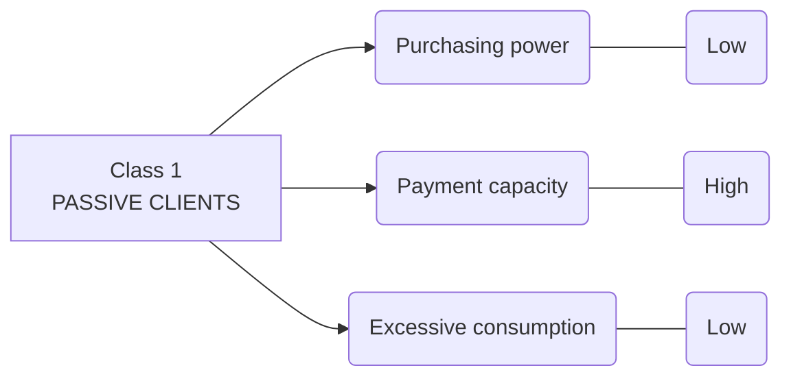


> The second class is made up of very low balance clients, actually the second lowest among the classes. They are the class with the lowest rate of purchases, whether in instant purchases or installment purchases. The aforementioned is reflected in your credit limit, since you earn little money, do not enter installments and have a low rate of payments through your cards, your credit limit is relatively low. Socially, they are low-income people who do not have the possibility of accessing constant purchases, they prefer to save their money and not take risks. **These clients were called inactive clients.**


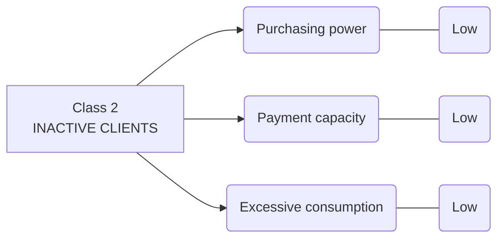


> The third class is made up of clients with the lowest balance on the card but who make cash purchases, that is, they do not earn much money and their salary on the card is low, however, they continue to consume, make purchases frequently, whether for goods or services, by means of a credit card, generally in installments or installments because it is not possible for them to pay instantly due to the little money they have in their accounts. In addition, the payment limit is lower than the global average for all clients, due to their low income level. It is not the lowest credit limit among the classes because, by frequently making installment purchases, their credit history is good, however, the time in which they pay their debts is not favorable for their credit limit. They are low-income people who are passionate about indulging their frequent desires, even if that means paying installments. **They were called active clients.**


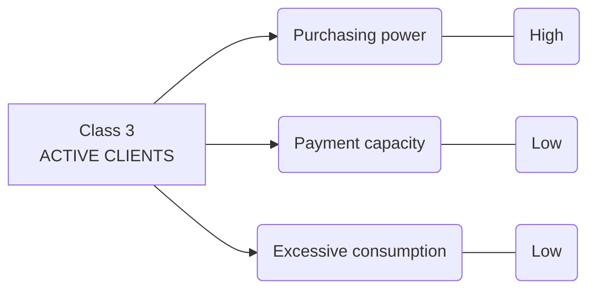


> In the fourth class are present clients who use credit cards more, since they maintain a high rate of frequent purchases instantly or in installments, because they handle a large amount of money and keep a balance to later acquire any good or service. , which is why they have a high profile in the banking institution and benefit from obtaining a higher credit limit, in addition to withdrawing very little cash in advance. Socially, they were called high-income people who spend their money to satisfy their tastes, apart from their basic needs. **These people are potential clients.**


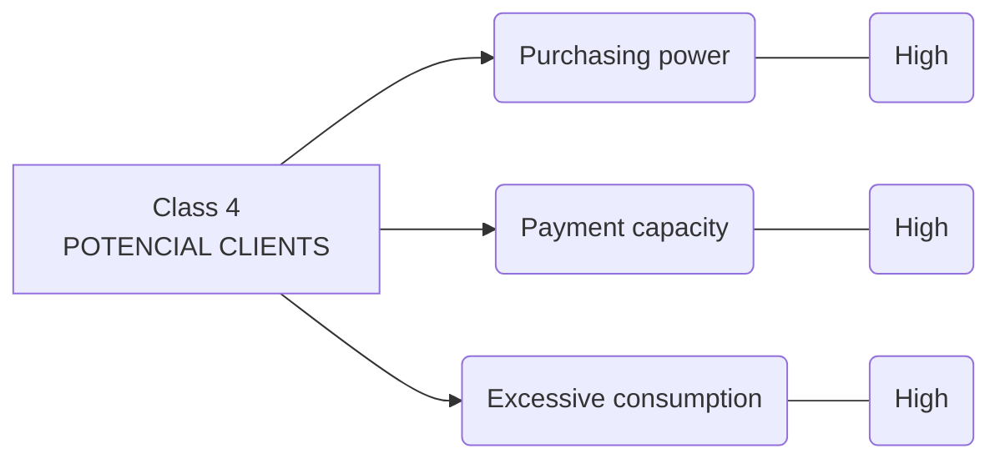


## Market strategies

* Passive clients, they have very low purchases, due to the lack of information on promotions and discounts, for which, from the user's database, a telephone number can be contacted and begin to make informative use of that means of communication. Likewise, the advisors can be in contact by means of telephone calls, in order to spread the information and make sure that the user obtains the benefits. To motivate you, you can initially generate promotions, accumulation of points that can later be redeemed in some good or cash refunds.


* Inactive clients, an incentive plan can be implemented, where an order of quotas is proposed, which allow them to go to certain places to access a product as a reward for the high use of credit cards, this strategy can be carried out carried out in the people who buy the most and with that constant use is promoted.


* Active clients, by maintaining constant purchases, the accumulation of points can be implemented, either to obtain a free product or with good discounts and the exclusivity of participating in raffles of some good, such as appliances. Likewise, up to 3 installments without interest can be managed, with the aim that the client is motivated and makes their purchases.


* To encourage the best credit card clients, rewards or incentives can be generated for the number of purchases made, whether monthly or semi-annually, likewise, miles can be accumulated so that users can obtain tickets without high costs on planes and in the VIP area, as well as tickets to concerts, entertainment areas, restaurants, among others.


## New clients


 


```r

ind.test <- Datos[8632:8636, 1:17] #5 clientes para realizar la prediccion

head(ind.test)

ind.test.coord <- predict(res.pca, newdata = ind.test)
ind.test.coord[, 1:3] # Miro los primeros dos componentes


# Utilizo el gráfico anterior y le anexo los nuevos individuos

p <- fviz_pca_ind(res.pca, repel = TRUE)

fviz_add(p, ind.test.coord, color ="blue")


nuevospuntos<-data.frame(ind.test.coord)

NP2<-data.frame(names = rownames(nuevospuntos), nuevospuntos)

Newgrafico<-data.frame((resultado_ACP$dudi)$li , Grupo)

X11()
#PC1 ; PC2
ggplot(Newgrafico, aes(x = Axis1, y = Axis2, color = Grupo)) +
  geom_point() +
  geom_point(NP2, mapping=aes(x=PC1,y=PC2, color = "Nuevos", 
label = names), size=5.5)+ theme_bw()


```



We managed to classify customers into classes depending on their characteristics in the use of the credit card. However, the banking institution will not always have the same number of clients and these will not always present the same behavior, therefore, it is necessary that the created model has the ability to predict to which group a client with new characteristics should belong management regarding the use of your credit card.

That said, a classification test was carried out with 5 clients without a group, to evaluate the effectiveness of the model at the time of cataloging. This test is done graphically, incorporating new clients represented by purple dots in the plans previously designed in graph 4; It is worth mentioning that the value of the characteristic variables of the five clients with respect to the use of their credit card is known.


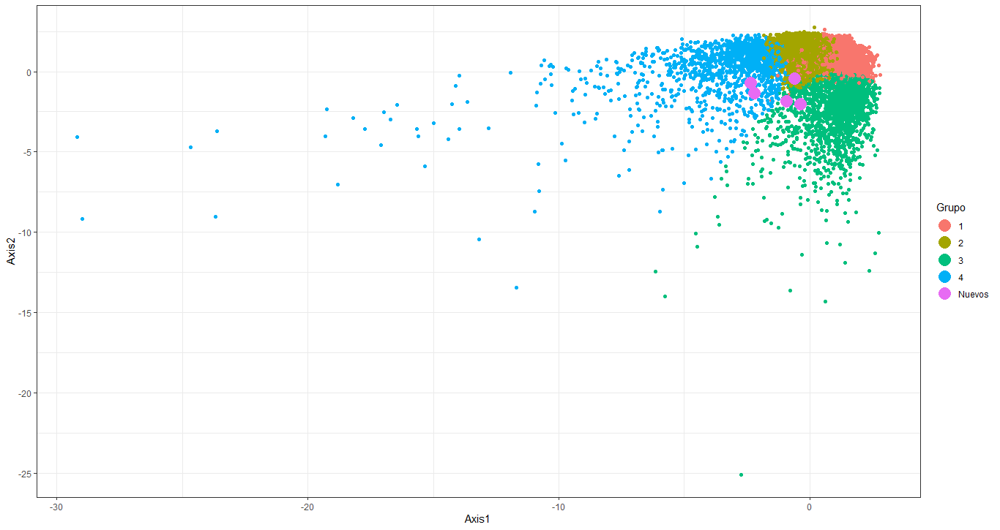


The visualization of the new clients in the groups is better illustrated in the plane composed of components 1 and 2, for this reason the main analysis was carried out with this plane. Now, among these 5 clients, the model classified 3 of them as members of group 2 (inactive clients), and the rest as members of group 3 (active clients).


### Supervised learning

We realize a supervised analyses using the classification founded in the clustering. We use 75% of the data as training, and 25% as test.

The class that better is classified is 4. Potencial Clients.


 


```r

NuevaBase <- NuevaBase %>% 
  rename(grupo = Cluster ) %>% 
  mutate_at(c("grupo"), ~as.factor(.))


IndexEntrena<-createDataPartition(y = NuevaBase$grupo, p=0.75 , list = FALSE)


SP_entrena <- NuevaBase[IndexEntrena,]
SP_test <- NuevaBase[-IndexEntrena,]


SP_knnEntrenado <- train(grupo ~ .,
                         data = SP_entrena, 
                         method = "knn",  
                         tuneLength = 20)

class(SP_knnEntrenado)


SP_knnEntrenado

X11()
plot(SP_knnEntrenado)

SP_ctrl <- trainControl(method="cv", number = 5) #Metodo de validación cruzada


SP_knnEntrenado <- train(grupo ~ ., 
                         data = SP_entrena, 
                         method = "knn",  
                         tuneLength = 20,
                         trControl = SP_ctrl,
                         preProcess = c("center", "scale"))

                         
SP_knnEntrenado

x11()
plot(SP_knnEntrenado) # Aprece un nuevo k optimo! K=7

plot(SP_knnEntrenado,pch=8 ,bty="1",bg="seagreen2
     nos", ylab = "Precision (Validación Cruzada)", xlab= "vecinos" ) #Grafica de K vs Precision


SP_knnPrediccion <- predict(SP_knnEntrenado, newdata = SP_test)


SP_knnPrediccion %>%  
  head(50)

prob_knnPrediccion <- predict(SP_knnEntrenado, newdata = SP_test, type= "prob")

prob_knnPrediccion %>% 
  head(10)   #Probabilidades para catalogar a que grupo pertenece el cliente

confusionMatrix(SP_knnPrediccion, SP_test$grupo)

```




```r
Confusion Matrix and Statistics

          Reference
Prediction    1    2    3    4
         1  463  118    4    1
         2  182 1099   51    0
         3   19   23  180    0
         4    0    0    0   18

Overall Statistics
                                          
               Accuracy : 0.8156          
                 95% CI : (0.7986, 0.8317)
    No Information Rate : 0.5746          
    P-Value [Acc > NIR] : < 2.2e-16       
                                          
                  Kappa : 0.665           
                                          
Statistics by Class:

                     Class: 1 Class: 2 Class: 3 Class: 4
Sensitivity            0.6973   0.8863  0.76596 0.947368
Specificity            0.9177   0.7462  0.97816 1.000000
Pos Pred Value         0.7901   0.8251  0.81081 1.000000
Neg Pred Value         0.8721   0.8293  0.97159 0.999533
Prevalence             0.3077   0.5746  0.10890 0.008804
Detection Rate         0.2146   0.5093  0.08341 0.008341
Detection Prevalence   0.2715   0.6172  0.10287 0.008341
Balanced Accuracy      0.8075   0.8162  0.87206 0.973684
```


### Made by 🙌

  

<br>

📚  [Kleiner J. Balanta](https://www.linkedin.com/in/kleiner-johan-balanta-amu-aa2611214/) - Student of Industrial Engineering

(Universidad del Valle)


<br>

📚  [Laura V. Cicery](https://www.linkedin.com/in/laura-vanessa-cicery-mu%C3%B1oz-247800245/) - Student of Industrial Engineering

(Universidad del Valle)


<br>

📚  [Sofia Vivas](https://www.linkedin.com/in/sofia-vivas-marin-265a83208/) - Student of Industrial Engineering

(Universidad del Valle)


<br>

📚  [Carlos A. Cruz](https://www.linkedin.com/in/carlos-arturo-cruz-hoyos-194643208/) - Student of Industrial Engineering

(Universidad del Valle)

