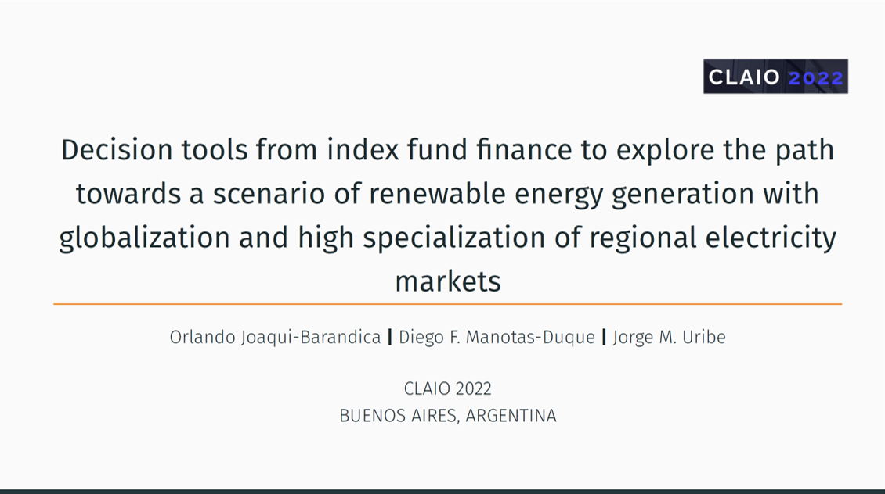
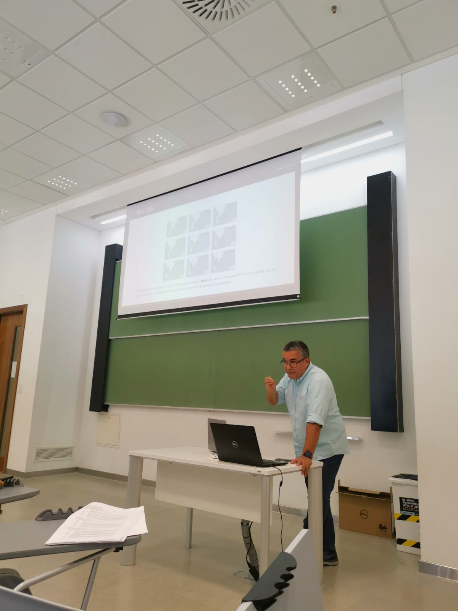
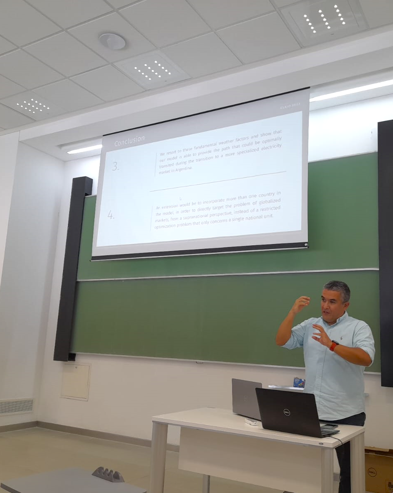

On this occasion, Professor Diego F. Manotas from the Universidad del Valle presented the research "Decision tools from indexed fund financing to explore the path towards a renewable energy generation scenario with globalization and high specialization of regional electricity markets" at the XXI LATIN IBERO-AMERICAN CONFERENCE ON
OPERATIONS RESEARCH - CLAIO 2022 in Buenos Aires, Argentina.

This research is carried out jointly with Professor Jorge M. Uribe from the Universidad Oberta de Cataluña and myself. This is the second event in which this research is presented. In November 2022 it was presented at the 8th ELAEE - 2022.

👋 All Comments are welcome. 

📩 *orlando.joaqui@correounivalle.edu.co* \

