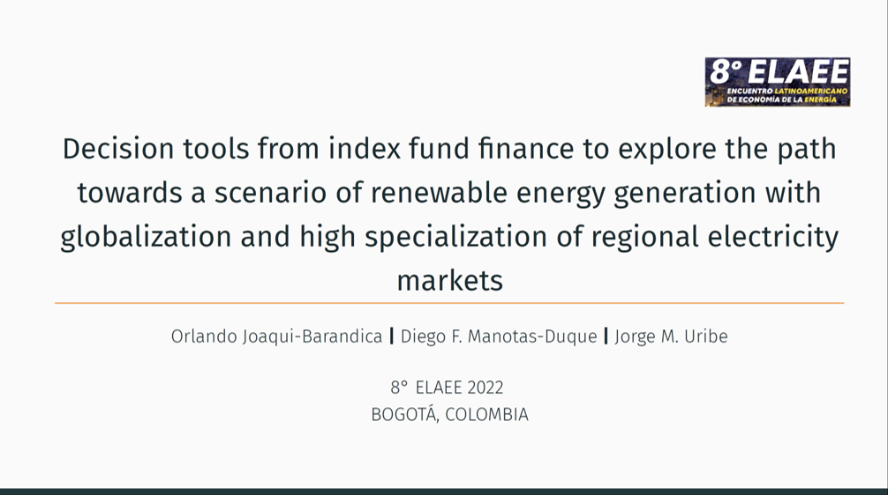
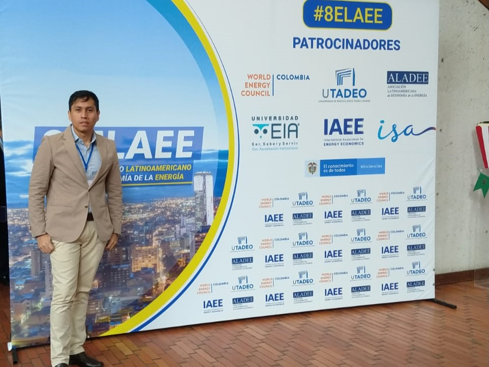

I will be at the 8° ELAEE 2022 – Energy Transition in Latinamerica that will take place at the Universidad de Bogotá Jorge Tadeo Lozano, next November 20 and 22, 2022.

I will present the research "Decision tools from index fund finance to explore the path towards a scenario of renewable energy generation with globalization and high specialization of regional electricity markets". This research is carried out in conjunction with, Professor Diego Manotas from the Universidad del Valle, and Professor Jorge M. Uribe from the Universidad Oberta de Cataluña.

* Link for slides: [👉Here!](https://juniorjb5.github.io/ELAEE/Slides.html#1)

👋 All Comments are welcome. 

📩 *orlando.joaqui@correounivalle.edu.co* \

