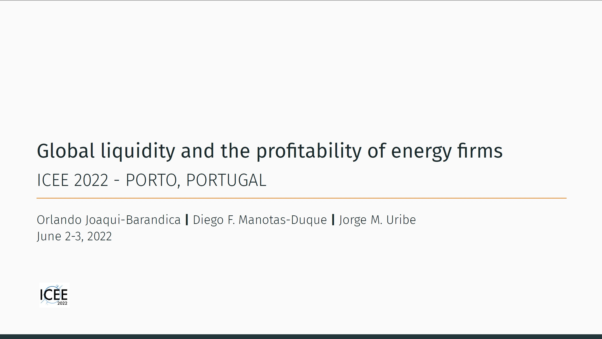
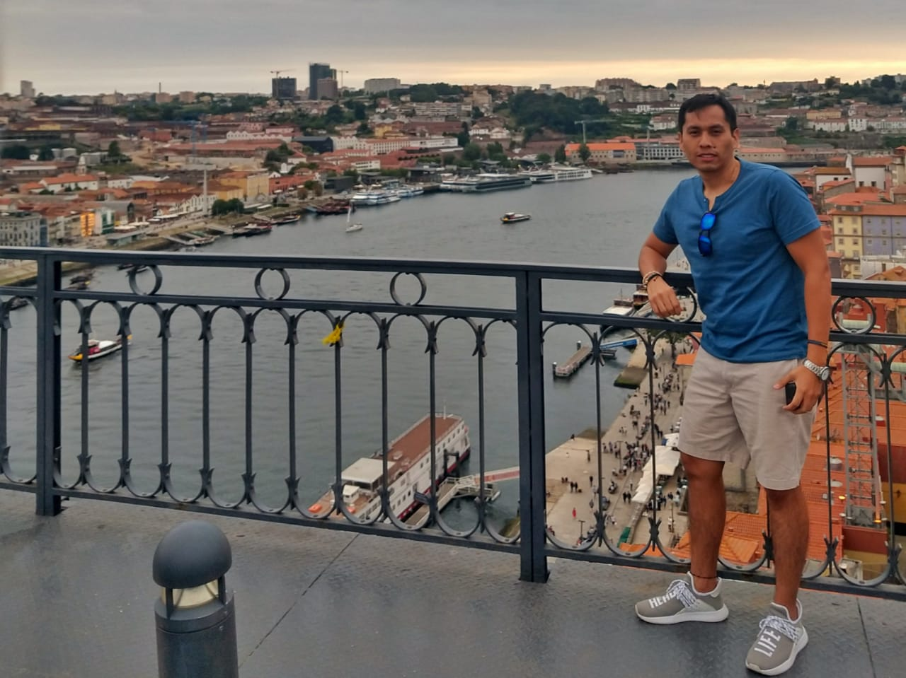
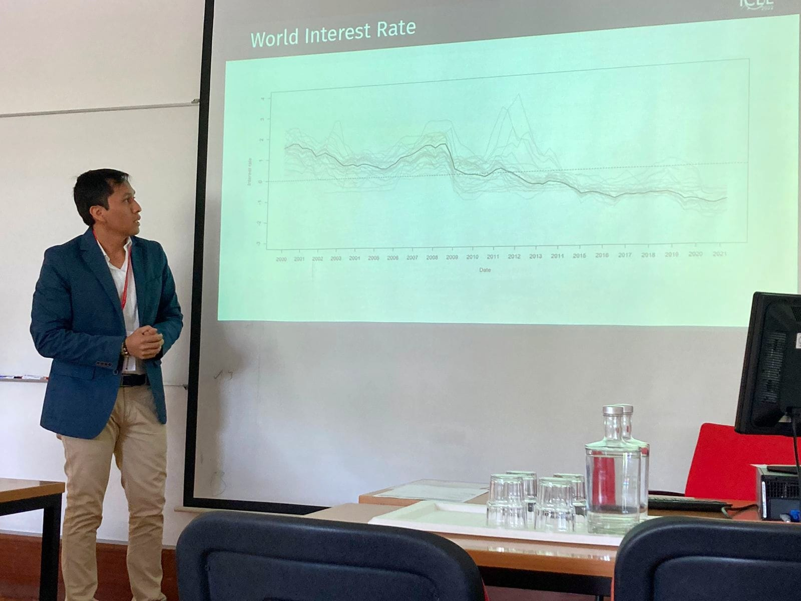

I will be at the ICEE 2022 – Energy and Environment: Uniting Economy and Engineering that will take place at the University of Porto, next June 2 and 3, 2022.

I will present the research "Global liquidity and the profitability of energy firms". This research is carried out in conjunction with, Professor Diego Manotas from the Universidad del Valle, and Professor Jorge M. Uribe from the Universidad Oberta de Cataluña.

Definitely a great academic adventure.

* Link for slides: [👉Here!](https://juniorjb5.github.io/ICEE2022/Presentation_ICEE_2022.html#1)

👋 All Comments are welcome. 

📩 *orlando.joaqui@correounivalle.edu.co* \

