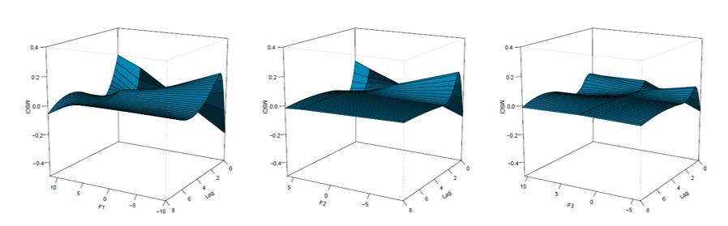
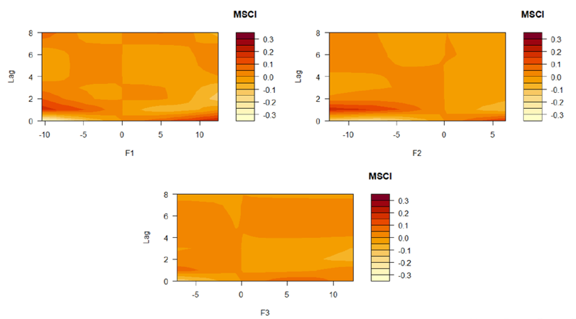

### Distributed lag non-linear models (DLNM) of the effect of macroeconomic factors on the MSCI Colombia index of market capitalization in the stock market during the period 2001 to 2020

This work is part of the thesis developed by students **Brayan Osorio Vanegas** and **Carolina Ramírez Patiño** from the academic program of Statistics at Universidad del Valle. On this occasion, we had the opportunity to participate in the advances in statistical workshop developed by the Colombian Statistics Society (SCE - *Sociedad Colombiana de Estadística*), Inter American Statistical Institute, and National University of Colombia (UNAL - *Universidad Nacional de Colombia*).

 Download the slides.

### Abstract

This paper proposes to study the external macroeconomic determinants on financial markets. Under the hypothesis of efficient markets, prices reflect all available information, so this paper will focus on the MSCI Colombia index, which measures the high and mid-capitalization segments of the stock market. The literature focuses on studying the macroeconomic effects at the variable level on the income market. However, from the statistical and econometric point of view, the possible omission of different effects associated with macroeconomic variables that are not considered in the different models in the literature is proposed, this shows a possible increase in the error of the estimates, which can generate biased estimates of macroeconomic movements on returns in the stock market. This is why a detailed analysis of the impact of the global set of macroeconomic variables on market capitalization is necessary. 

In this work, the generation of latent macroeconomic factors is proposed from a large set of variables, subsequently the macroeconomic factors are identified and interpreted to determine the effects in the terms of trade on the MSCI Colombia index. An extensive database is used, made up of 106 macroeconomic variables corresponding to the period 2001-2020, and the effect of macroeconomic shocks is estimated using a DLNM model.

Our results show there are mainly three statistical factors that underlie the macroeconomic dynamics in Colombia. The results suggest that the first latent factor is associated with economic activity. The second factor is related to the external sector (imports, exports and exchange rate), and the third factor to the labor force and retail. We conclude that the effects are asymmetric on the rental market in addition to achieving stabilization of the shock after the third period. In addition, we identify that the market is more sensitive to economic activity compared to other macroeconomic factors.

👋 All Comments are welcome. 

📩 *orlando.joaqui@correounivalle.edu.co* \
📩 *osorio.brayan@correounivalle.edu.co* \
📩 *carolina.ramirez.patino@correounivalle.edu.co*

