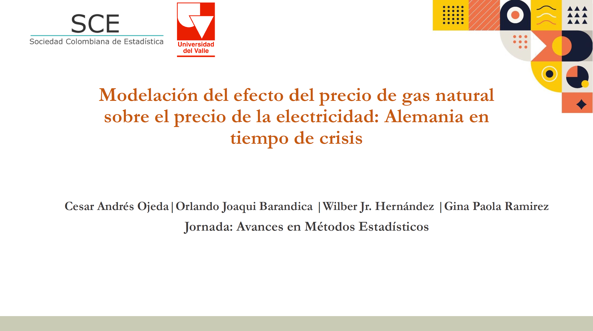
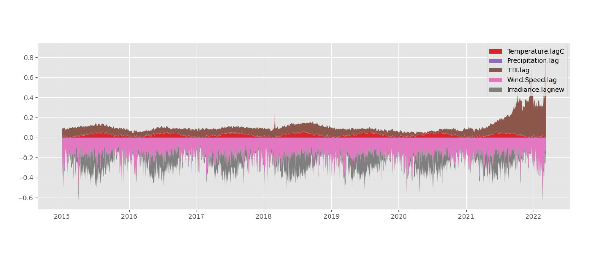

### Modeling the effect of the price of natural gas on the price of electricity: Germany in times of distress

This work is part of the thesis developed by students **Wilber Jr. Hernandez** and **Gina Paola Ramirez** from the academic program of Statistics at Universidad del Valle, under the joint direction of Professor **César Ojeda** and myself. On this occasion, we had the opportunity to participate in the advances in statistical workshop developed by the Colombian Statistics Society (SCE - *Sociedad Colombiana de Estadística*), and Universidad del Valle.

 Download the slides.

### Abstract

This paper proposes to observe the effect of the price of natural gas and the behavior of climatic factors on the price of electricity in times of crisis. At present it is known that Germany has increased the price of electricity due to complications for its production, which is produced by means of renewable and non-renewable energies. 

The first option being the most optimal since the cost is lower, however, they are not constant in the production flow due to the constant climatic changes, for which the electricity generated by non-renewable energies continues to have a large participation in Germany's electricity matrix. 

For this reason, natural gas continues to be the fundamental pillar for the production of electricity, but it has been affected in recent years, due to the reduction in imports of natural gas of which Russia is its largest supplier, generated by the political discussions with Ukraine, through which various sanctions have been presented, of which the export of natural gas has been one of them. For this reason, it is proposed to observe the impact of the price of natural gas on the price of electricity in Germany during a period of time from 2015 to 2022.

The use of GAS models is presented to observe the behavior of prices, the which allows a better adjustment of the data by having the versatility of working with distributions other than the normal distribution.

Our results show: the price of natural gas presents a direct positive correlation with the price of electricity since if there is a shortage of natural gas as it occurred thanks to Russia's problems with its exports, natural gas tends to increase its price and in turn the price of electricity respectively. In addition, climatic variables are important because they help to counteract the effect that the increase in the price of gas is producing.

👋 All Comments are welcome. 

📩 *orlando.joaqui@correounivalle.edu.co* \
📩 *cesar.ojeda@correounivalle.edu.co* \
📩 *gina.ramirez@correounivalle.edu.co* \
📩 *wilber.hernandez@correounivalle.edu.co*

