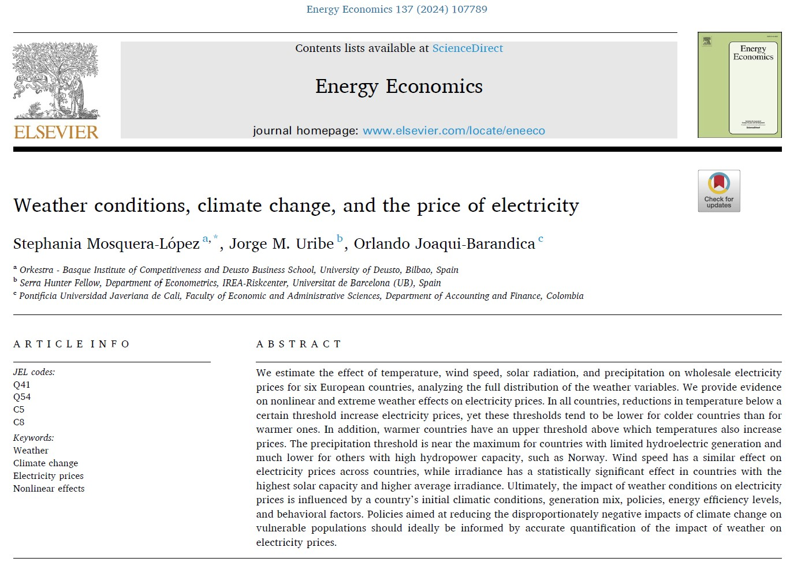

## Visit

- 👉 [**Full Publication**](https://doi.org/10.1016/j.eneco.2024.107789)

**A pleasure to work with this team**

- 👨‍🏫 [**Stephania Mosquera-López**](https://www.linkedin.com/in/smosqueral/)

- 👨‍🏫 [**Jorge M. Uribe**](https://jorgemuribe.wordpress.com/)

