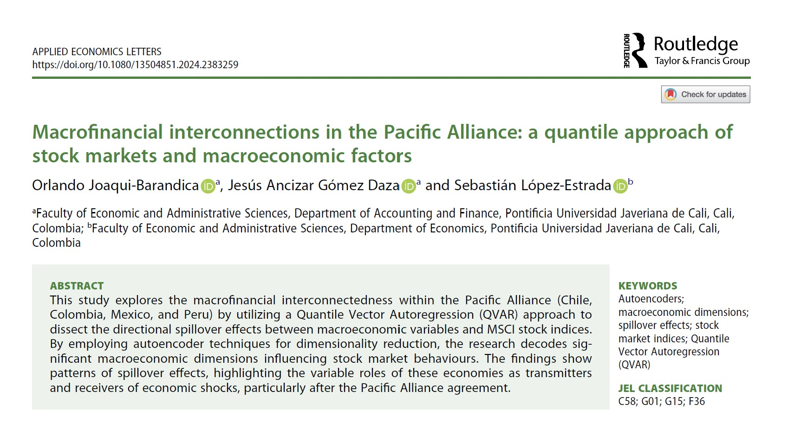

## Visit

- 👉 [**Full Publication**](https://doi.org/10.1080/13504851.2024.2383259)

**A pleasure to work with this team**

- 👨‍🏫 [**Jesús Ancizar Gómez**](https://www.javerianacali.edu.co/profesores/jesus-ancizar-gomez-daza)

- 👨‍🏫 [**Sebastián López-Estrada**](https://www.javerianacali.edu.co/profesores/sebastian-lopez-estrada)

