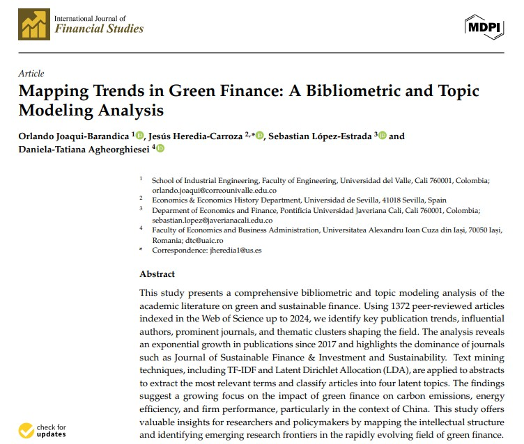

## Visit

- 👉 [**Full Publication**](https://doi.org/10.3390/ijfs13030137)

**A pleasure to work with this team**

- 👨‍🏫 [**Jesús Heredia-Carroza**]
- 👨‍🏫 [**Sebastián López-Estrada**]
- 👨‍🏫 [**Daniela-Tatiana Agheorghiesei**]

