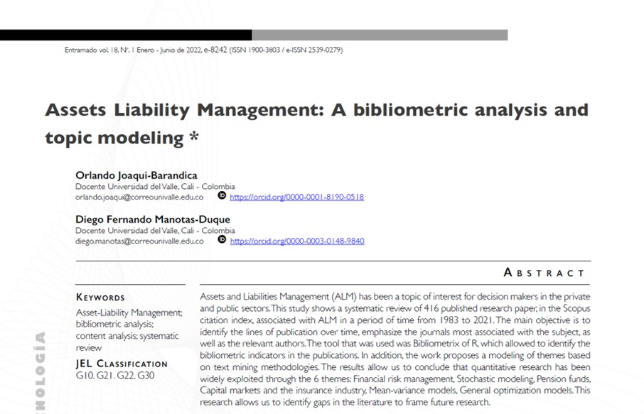

## Visit

- 👉 [**Full Publication**](https://revistas.unilibre.edu.co/index.php/entramado/article/view/8242/7645)

This article is the first publication in a national journal (Colombia) of our research work on asset and liability management. The main objective was to identify the lines of research on the subject so that new research can use it as a starting point and obviously fill some gaps.

**A pleasure to work with this team**

- 👨‍🏫 [**Diego F. Manotas-Duque**](http://industrial.univalle.edu.co/profesores/diego-fernando-manotas-duque)

