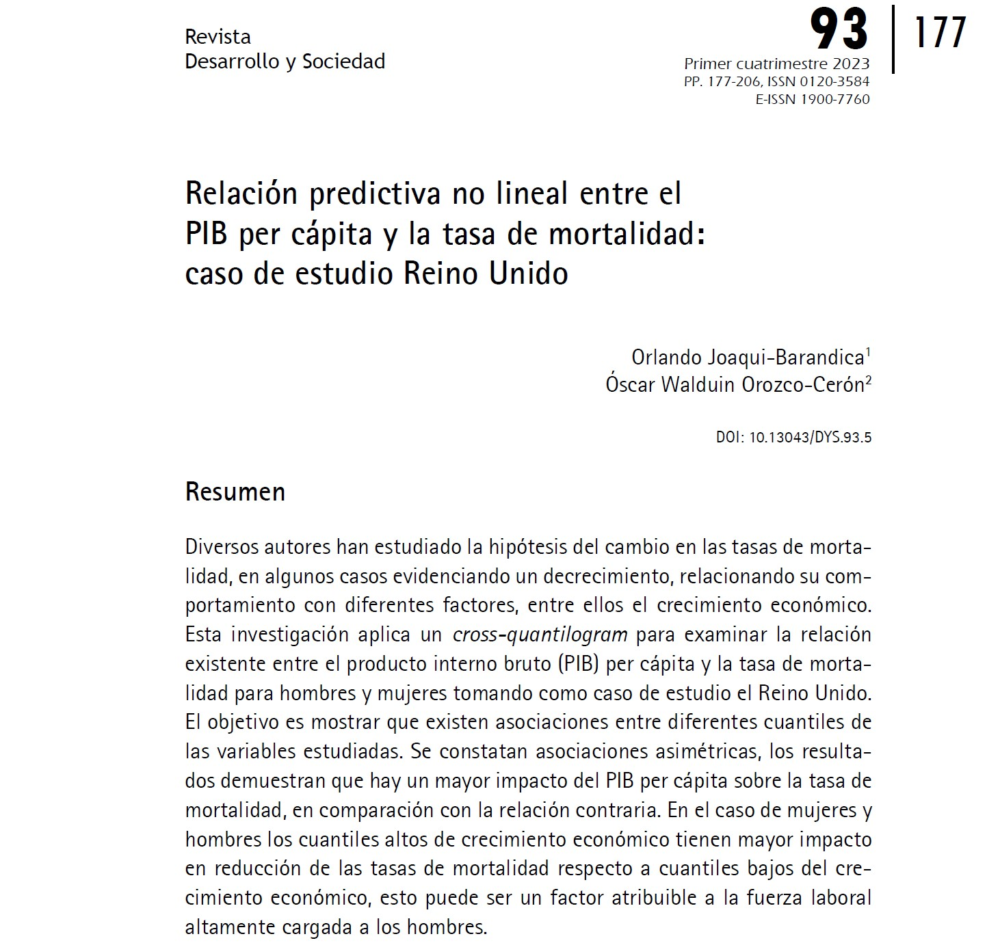

## Visit

- 👉 [**Full Publication**](https://revistas.uniandes.edu.co/index.php/dys/article/view/221/8386)

This article is the result of several discussions with my dear friend Oscar Orozco. It's a pleasure to share with you the results of our research.

- 👨‍🏫 [**Oscar W. Orozo-Cerón**](https://www.linkedin.com/in/oscar-walduin-orozco-cer%C3%B3n-b9a47b77/)

