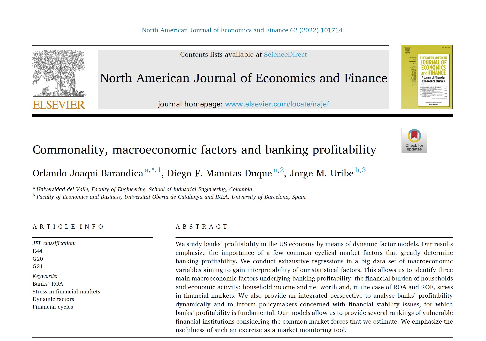

## Visit

- 👉 [**Full Publication**](https://doi.org/10.1016/j.najef.2022.101714)

This article is the second publication of our research work on asset and liability management. The main objective was to identify the macroeconomics factors underlying the dynamics of bank profitability.

**A pleasure to work with this team**

- 👨‍🏫 [**Diego F. Manotas-Duque**](http://industrial.univalle.edu.co/profesores/diego-fernando-manotas-duque)
- 👨‍🏫 [**Jorge M. Uribe**](https://jorgemuribe.com/)

