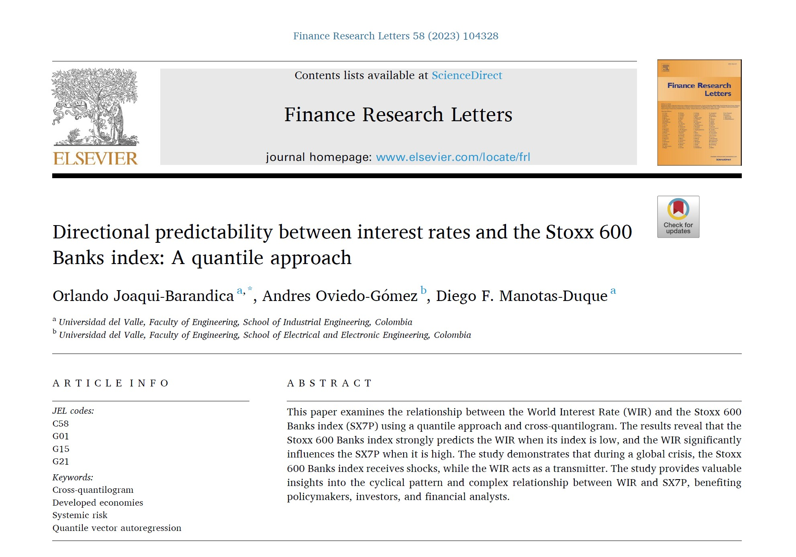

## Visit

- 👉 [**Full Publication**](https://doi.org/10.1016/j.frl.2023.104328)

This article is the fourth publication of our research work on asset and liability management. The study examines how fluctuations in the performance of European banks and global interest rates mutually influence each other under different economic conditions, providing valuable information for asset and liability management in a changing financial environment..

**A pleasure to work with this team**

- 👨‍🏫 [**Andrés Oviedo-Gómez**](https://sites.google.com/view/a-oviedo-gomez/home?authuser=0)

- 👨‍🏫 [**Diego F. Manotas-Duque**](http://industrial.univalle.edu.co/profesores/diego-fernando-manotas-duque)

