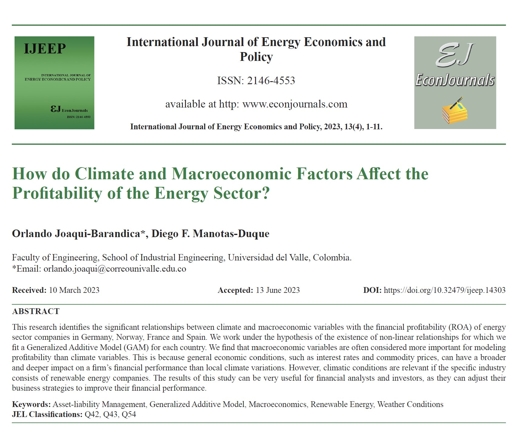

## Visit

- 👉 [**Full Publication**](https://doi.org/10.32479/ijeep.14303)

This article is the third publication of our research work on asset and liability management. The main objective was to identify the relation between climate and macroeconomics factors on the profitability.

**A pleasure to work with this team**

- 👨‍🏫 [**Diego F. Manotas-Duque**](http://industrial.univalle.edu.co/profesores/diego-fernando-manotas-duque)

