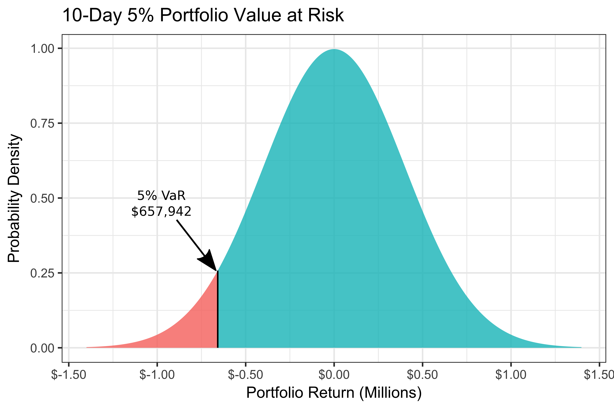

```{r setup, include = FALSE}
library(knitr)                              # paquete que trae funciones utiles para R Markdown
library(tidyverse)                          # paquete que trae varios paquetes comunes en el tidyverse
library(datos)                              # paquete que viene con datos populares traducidos al español :)
library(shiny)
library(icons)
# opciones predeterminadas
knitr::opts_chunk$set(echo = FALSE,         # FALSE: los bloques de código NO se muestran
                      dpi = 300,            # asegura gráficos de alta resolución
                      warning = FALSE,      # los mensajes de advertencia NO se muestran
                      error = FALSE)        # los mensajes de error NO se muestran


options(htmltools.dir.version = FALSE)


library(tidyverse)
library(lubridate)
library(readxl)
library(highcharter)
library(tidyquant)
library(timetk)
library(tibbletime)
library(quantmod)
library(PerformanceAnalytics)
library(scales)


library(tidyverse)
library(lubridate)
library(readxl)
library(highcharter)
library(tidyquant)
library(timetk)
library(tibbletime)
library(quantmod)
library(PerformanceAnalytics)
library(scales)

```


class: inverse, left, bottom
background-image: url("img/pitana3.jpg")
background-size: cover


# **`r rmarkdown::metadata$title`**
----

## **`r rmarkdown::metadata$institute`**

### `r rmarkdown::metadata$author`
### `r rmarkdown::metadata$date`

```{r xaringanExtra-share-again, echo=FALSE}
xaringanExtra::use_share_again()
```

```{r xaringanExtra-clipboard, echo=FALSE}
xaringanExtra::use_clipboard()
```

---
name: hola
class: inverse, middle, center
background-color: #E31D1D


# Universidad del Valle


---


<br><br>

.center[


[PhD.(C) Orlando Joaqui-Barandica](https://www.joaquibarandica.com) <br/>
Universidad del Valle
]

<br>


.center[

*PhD.(C) Ingeniería con enfásis en Ingeniería Industrial* 
 
*MSc. Economía Aplicada*
 
*Estadístico*

<br>

`r icon::fa("link", animate = "spin")` [www.joaquibarandica.com](https://www.joaquibarandica.com)

]


---

class: center, middle


### [https://gifinc.univalle.edu.co/](https://gifinc.univalle.edu.co/)


---

name: VaR
class: inverse, center, middle
background-color: #00081d

# `r icon("upload")`
# VaR - Value at Risk

----

.right[
.bottom[
####  [`r icon("bell")`](#menu)
]
]

---

# `r icon("circle")` VaR


.pull-left[

<br>
<br>

El Valor en Riesgo (VaR) es una de las medidas utilizadas para evaluar el riesgo de una determinada posición o cartera de activos financieros.

<br>

La definición del VaR puede hacerse en términos de **rentabilidades** o en términos de **Pérdidas y Ganancias** (términos nominales).

]


.pull-right[


]


---


class: center, middle


# El VaR responde entonces a la pregunta:


### ¿Cuál es la caída o pérdida que se podría sufrir en condiciones normales de mercado en un intervalo de tiempo y con cierto nivel de probabilidad o de confianza?


---


class: center, middle

## Es decir, indica la probabilidad (normalmente 1% o 5%) de sufrir una determinada pérdida durante un periodo de tiempo (normalmente 1 día, 1 semana o 1 mes).

--

<br>

## Una interpretación equivalente es:

--

<br>

### Con probabilidad $$1- \alpha$$ el propietario de dicha posición experimentará una pérdida no superior al VaR.

---

# `r icon("circle")` VaR

.pull-left[

Ejemplo:

<br>

> Una entidad financiera podría considerar que el **VaR** diario de una cartera operativa es de 50 millones de euros, con un nivel de confianza del 90%. 

<br>

----

<br>

> Esto quiere decir que solamente hay 1 posibilidad en 10, en condiciones normales de mercado, de que haya una pérdida superior a los 50 millones de euros.

]


.pull-right[


]


---

# `r icon("circle")` VaR


```{r Var1, echo=FALSE, fig.align="center", out.width="50%"}

```

.center[

### Por consiguiente, el VaR no es sino un determinado percentil de la distribución de probabilidad prevista para las variaciones en el valor de mercado de la cartera en el horizonte de tiempo escogido.

]

---

# `r icon("circle")` Cálculo del VaR


## Tipos de VaR


- **VaR Histórico, No Paramétrico:** se encuentra el $\alpha$ percentil de la distribución histórica de los datos.

<br/>

- **VaR Paramétrico:** se calcula el VaR con base en un modelo que describe su función de densidad de las pérdidas. La cual debe ser estimada.
  - VaR suponiendo que las pérdidas siguen una distribución Gaussiana no condicional.

  - VaR modelando los valores futuros de la media y la varianza condicionales.

  - VaR por simulación de Montecarlo (estimando la función multivariada que describe los datos, por ejemplo mediante cópulas)


---


# `r icon("circle")` Cálculo del VaR


## Tipos de VaR: Método No Paramétrico - Histórico


.pull-left[

- No precisa hacer supuestos acerca de la forma paramétrica de la distribución de rentabilidades de los factores de riesgo o de la cartera.

- No está limitado a carteras en las que los pagos tienen una estructura lineal.

- El método histórico debe utilizarse solo para el cálculo del VaR a un horizonte de muy pocos días.


]


.pull-right[

$$VaR_{(1-\alpha)} = q_{(1-\alpha)(R)}  \nonumber$$

]


---


# `r icon("circle")` Cálculo del VaR


## Tipos de VaR: Método Paramétrico - Distribución Gaussiana


.pull-left[

- Suponemos que la distribución de las rentabilidades de los factores sigue una distribución Normal multivariante y la cartera es función lineal de los factores.

- Su ventaja es que es tratable analíticamente, pero solo se puede generalizar a una pocas formas paramétricas, como la Normal, la t-Student, o mixturas de Normales o de t-Student.


]


.pull-right[


.center[
Como $\alpha$ es un valor reducido: 5%, 1% o 0.01%, entonces $R^*$ será una rentabilidad negativa, y el VaR se proporciona cambiando el signo.
]


$$VaR = -R^{\*} \Rightarrow \alpha = P(R<R^{\*}) = \Phi\left( \frac{R^{\*}-\mu_R}{\sigma_R} \right) \nonumber$$

$$VaR_{(1-\alpha)} = \Phi^{-1}(1-\alpha) \sigma_R - \mu_R  \nonumber$$


]

---


# `r icon("circle")` Cálculo del VaR


## Tipos de VaR: Método de normalidad estático


$$VaR_{(1-\alpha)} = \Phi^{-1}(1-\alpha) \sigma_R - \mu_R  \nonumber$$


## Tipos de VaR: Método de normalidad condicional


$$VaR_{(1-\alpha),t+1} = \Phi^{-1}(1-\alpha) \sigma_{R,t+1} - \mu_{R,t+1}  \nonumber$$


- Estimación de $\mu_{t+1}$: Modelos ARIMA de series de tiempo
- Estimación de $\sigma_{t+1}$: Modelos de varianza condicional:
  - Modelos GARCH: como un ARMA sobre la varianza con algunas restricciones.
  - Modelos de Volatilidad Estocástica: una versión más general de los GARCH.


---


# `r icon("circle")` Cálculo del VaR


## Tipos de VaR: Método de simulación MonteCarlo - estático


$$VaR_{(1-\alpha)} = \sigma_R(-q_{(1-\alpha)}(Z))  - \mu_R, \quad \quad Z\sim N(0,1)  \nonumber$$


## Tipos de VaR: Método de simulación MonteCarlo - dinámico


$$VaR_{(1-\alpha)} = \sigma_{R,t+1}(-q_{(1-\alpha)}(Z))  - \mu_{R,t+1}, \quad \quad Z\sim N(0,1)  \nonumber$$

---

# `r icon("circle")` Limitaciones


.pull-left[

Como se puede observar existen diversas metodologías, con diferentes niveles de precisión, para estimar el Valor en Riesgo. No obstante, todas estas metodologías presentan limitaciones generales, que caracterizan la técnica del VaR y que por ende son imposibles de evitar sin recurrir a otras herramientas.


----

> - Dice muy poco sobre los casos en las colas (pérdidas extremas).
> - Puede crear estructuras perversas de incentivos (porque no se conoce la magnitud de las pérdidas que exceden las colas).

----

]

.pull-right[


]


---

# `r icon("circle")` Expected Shortfall (CVaR)


.pull-left[

Mientras que el **VaR estima lo máximo que se puede esperar perder** si un evento de pérdidas extremas no ocurre, es decir, la peor pérdida esperada en caso de una relativa regularidad financiera, el **ES (Expected Shortfall) indica cuánto se espera perder si un evento extremo efectivamente ocurre** (más allá del nivel de confianza del VaR, en las colas de la distribución).


----


$$ES = E[R / ( R < VaR )] \nonumber$$

----

]

.pull-right[


```{r Var2, echo=FALSE, fig.align="center", out.width="75%"}
knitr::include_graphics("img/Imagen3.PNG")
```


]


---

# `r icon("circle")` Código en R


.scroll-output[

```{r eval =FALSE, echo=TRUE, message=FALSE, warning=FALSE , fig.height = 6 }

library(quantmod)
library(PerformanceAnalytics)


#########Fecha inicial de descarga de datos
maxDate = "2000-01-01"

#Serie a descargar
tick<-"AMZN"

#Obtener la serie de precios desde Yahoo Finance
prices <- Ad(getSymbols(tick, auto.assign = FALSE, from=maxDate))
plot(prices)
View(prices)


#Calcular retornos
rets <- dailyReturn(prices)
plot(rets)
hist(rets)


library(tseries)
jarque.bera.test(rets)


#Calcular VaR y CVaR
VaR(rets,p=0.95,method = "historical")
quantile(rets,0.05)

VaR(rets,p=0.99,method = "gaussian")
VaR(rets, p = 0.99, method = "historical")
ES(rets,p=0.99,method = "gaussian")
ES(rets, p = 0.99, method = "historical")


#Series que conforman el portafolio
tickers<- c("MSFT", "AAPL", "AMZN")

#Definir pesos del portafolio
weights<-c(0.5,0.1,0.4)

#Obtener series de precios del portafolio
getSymbols(tickers, from=maxDate)
View(AAPL)

#Crear el portafolio
Port.prices <- na.omit(merge(Ad(MSFT),Ad(AAPL), Ad(AMZN)))
colnames(Port.prices)<-tickers
View(Port.prices)
plot(Port.prices)


#Retornos del portafolio
Port.returns <- ROC(Port.prices,type="discrete")[-1]
colnames(Port.returns)<-tickers
View(Port.returns)
plot(Port.returns)

VaR(Port.returns,p=0.95, weights = weights, portfolio_method = "component", method = "historical")
ES(Port.returns,p=0.95, weights = weights, portfolio_method = "component", method = "historical")


#Calcular VaR Individual
VaR.Hist<- VaR(Port.returns,p=0.95, weights = NULL, portfolio_method = "single", method = "historical")
VaR.Gaus<- VaR(Port.returns,p=0.95, weights = NULL, portfolio_method = "single", method = "gaussian")
VaR.Mod<- VaR(Port.returns,p=0.95, weights = NULL, portfolio_method = "single", method = "modified")

#Guardar datos
All.VaR<-data.frame(rbind(VaR.Hist,VaR.Gaus,VaR.Mod))
rownames(All.VaR)<-c("Hist","Gaus","Mod")

All.VaR

#Calcular VaR Portfolio
Port.VaR.Hist<- VaR(Port.returns,p=0.95, weights = weights, portfolio_method = "component", method = "historical")$hVaR
Port.VaR.Gaus<- VaR(Port.returns,p=0.95, weights = weights, portfolio_method = "component", method = "gaussian")$VaR
Port.VaR.Mod<- VaR(Port.returns,p=0.95, weights = weights, portfolio_method = "component", method = "modified")$MVaR


All.VaR$Portafolio<-c(Port.VaR.Hist,Port.VaR.Gaus,Port.VaR.Mod)
All.VaR<-abs(All.VaR)
All.VaR$Type<-c("Hist","Gaus","Mod")

All.VaR

#Base para gráfico
library(reshape2)
library(ggplot2)
plotVaR<-melt(All.VaR,variable.name = "Ticker", value.name = "VaR")


g1<-ggplot(plotVaR,aes(x=Type,y=VaR, fill=Ticker))+
  geom_bar(stat="identity", position = "dodge") 

g1


############################################################################


#Simulación Monte Carlo para el VaR de una acción


#Instalar librerias

library(quantmod)
#library(tidyquant)
library(xts)
#library(rvest)
library(tidyverse)
#library(stringr)
#library(forcats)
#library(lubridate)
#library(plotly)
library(dplyr)
#library(PerformanceAnalytics)


#Simulamos un año bursatil

periodos <- 252
periodos <- periodos - 1

#descargamos los stocks

getSymbols("TSLA", from = '2015-01-01', to = "2022-01-06", warnings = FALSE, auto.assign = TRUE)

TSLA_adj <- TSLA$TSLA.Adjusted

TSLA_log_returns <- dailyReturn(Ad(TSLA), type="log")

# Creamos la función

gbm_sim <- function(periodos, close_prices, vector_returns) {
  # estimadores de mu y sigma
  mu <- mean(vector_returns)
  sig <- sd(vector_returns)
  fin <- length(vector_returns)
  ini <- fin - periodos
  
  # simulacion
  sim_actual_values <- TSLA$TSLA.Close[ini]
  S <-  vector(mode="numeric", length=periodos) # aqui vamos guardando los valores
  S[1] <- sim_actual_values
  for (t in c(2:periodos) ) {
    new_S <- S[t-1] * exp( (mu-(0.5*sig^2)) + sig * rnorm(1)   )
    S[t] <- new_S
  } 
  return(S)
}

#Ahora simulamos 1000 realidades distintas

# AHora podemos simular varias veces y plotear:
n_sims = 1000
n_periods = 252
sims <- matrix(NA, ncol=n_sims+1, nrow=n_periods)

for (i in 1:n_sims) {
  values <-  gbm_sim(periodos = 252, close_prices =  TSLA$TSLA.Adjusted, vector_returns = TSLA_log_returns)
  sims[, i] <- values
}
sims[, n_sims+1] <- 1:n_periods

# Seteo del plot
plot(sims[, n_sims+1], sims[,1], type="l",
     xlab="tiempo", ylab="W(t)", ylim=c(0, 2000))
colors = rainbow(n_sims)

# add lines
for ( i in 1:n_sims) {
  lines(sims[, n_sims+1], sims[,i], type="l", col=colors[i])
}


# VALUE AT RISK 
# En sims, tenemos los PRECIOS simulados. Necesitamos las rentabilidades.
# Tenemos que convertir, cada columna de sims, en Rentabilidades.

returns_gbm <- apply( sims[,c(1:n_sims)], 2, Delt)


# Histograma de todas esas rentabilidades
hist(returns_gbm, 40)

# Porcentil 5 -- VAR al  99% y 95%
quantile(returns_gbm, c(0.05, 0.01), na.rm=TRUE) 


# Histograma de todas esas rentabilidades
hist(returns_gbm, 40)
abline(v=quantile(returns_gbm, c(0.05), na.rm=TRUE) )


  
```

]

---


class: inverse, center, middle
background-color: #00081d


.pull-left[

.center[
<br><br>

# Gracias!!!

<br><br><br><br><br>


### Preguntas?
]


]


.pull-right[


.center[

<br><br><br>


.center[


`r anicon::faa("envelope", animate = "passing")` orlando.joaqui@correounivalle.edu.co 
]


```{r qr, echo=FALSE, fig.align="center", out.width="50%"}
knitr::include_graphics("img/qr-code.png")
```


.center[
www.joaquibarandica.com
]


]


]


<br><br><br>
----


